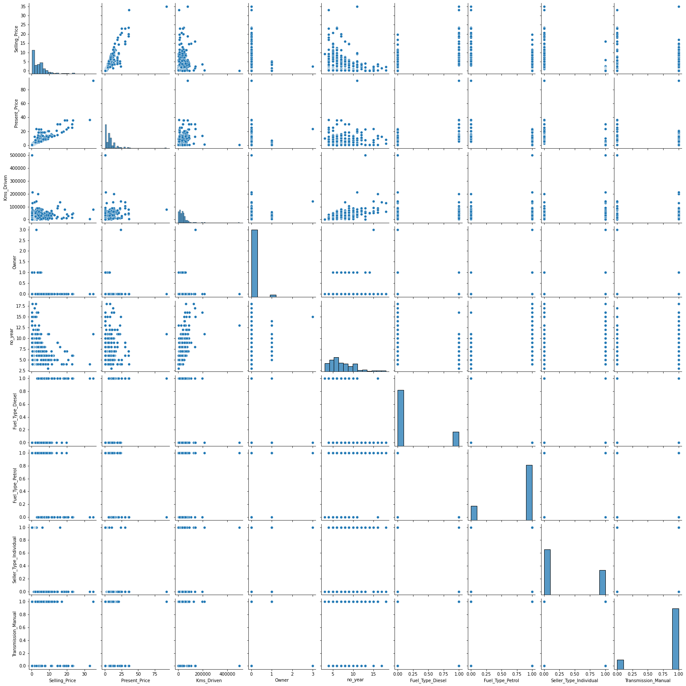
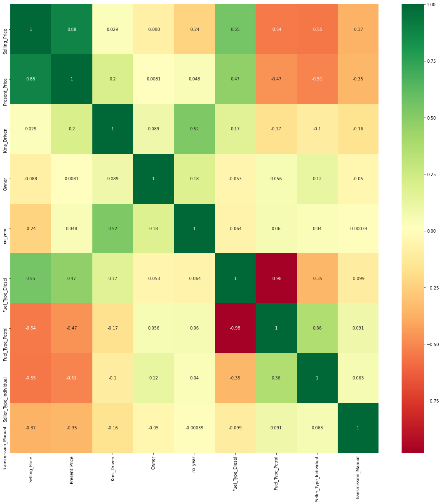
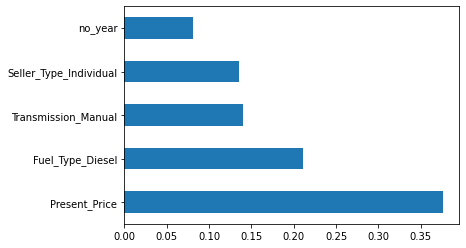
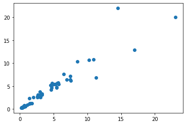

```python
import pandas as pd
```


```python
df=pd.read_csv("car data.csv")
```


```python
df.head()
```


<div>
<style scoped>
    .dataframe tbody tr th:only-of-type {
        vertical-align: middle;
    }

    .dataframe tbody tr th {
        vertical-align: top;
    }

    .dataframe thead th {
        text-align: right;
    }
</style>
<table border="1" class="dataframe">
  <thead>
    <tr style="text-align: right;">
      <th></th>
      <th>Car_Name</th>
      <th>Year</th>
      <th>Selling_Price</th>
      <th>Present_Price</th>
      <th>Kms_Driven</th>
      <th>Fuel_Type</th>
      <th>Seller_Type</th>
      <th>Transmission</th>
      <th>Owner</th>
    </tr>
  </thead>
  <tbody>
    <tr>
      <th>0</th>
      <td>ritz</td>
      <td>2014</td>
      <td>3.35</td>
      <td>5.59</td>
      <td>27000</td>
      <td>Petrol</td>
      <td>Dealer</td>
      <td>Manual</td>
      <td>0</td>
    </tr>
    <tr>
      <th>1</th>
      <td>sx4</td>
      <td>2013</td>
      <td>4.75</td>
      <td>9.54</td>
      <td>43000</td>
      <td>Diesel</td>
      <td>Dealer</td>
      <td>Manual</td>
      <td>0</td>
    </tr>
    <tr>
      <th>2</th>
      <td>ciaz</td>
      <td>2017</td>
      <td>7.25</td>
      <td>9.85</td>
      <td>6900</td>
      <td>Petrol</td>
      <td>Dealer</td>
      <td>Manual</td>
      <td>0</td>
    </tr>
    <tr>
      <th>3</th>
      <td>wagon r</td>
      <td>2011</td>
      <td>2.85</td>
      <td>4.15</td>
      <td>5200</td>
      <td>Petrol</td>
      <td>Dealer</td>
      <td>Manual</td>
      <td>0</td>
    </tr>
    <tr>
      <th>4</th>
      <td>swift</td>
      <td>2014</td>
      <td>4.60</td>
      <td>6.87</td>
      <td>42450</td>
      <td>Diesel</td>
      <td>Dealer</td>
      <td>Manual</td>
      <td>0</td>
    </tr>
  </tbody>
</table>
</div>


```python
df.shape
```


    (301, 9)


```python
df.info()
```

    <class 'pandas.core.frame.DataFrame'>
    RangeIndex: 301 entries, 0 to 300
    Data columns (total 9 columns):
     #   Column         Non-Null Count  Dtype  
    ---  ------         --------------  -----  
     0   Car_Name       301 non-null    object 
     1   Year           301 non-null    int64  
     2   Selling_Price  301 non-null    float64
     3   Present_Price  301 non-null    float64
     4   Kms_Driven     301 non-null    int64  
     5   Fuel_Type      301 non-null    object 
     6   Seller_Type    301 non-null    object 
     7   Transmission   301 non-null    object 
     8   Owner          301 non-null    int64  
    dtypes: float64(2), int64(3), object(4)
    memory usage: 21.3+ KB
    


```python
print(df['Seller_Type'].unique())
```

    ['Dealer' 'Individual']
    


```python
print(df['Fuel_Type'].unique())
```

    ['Petrol' 'Diesel' 'CNG']
    


```python
print(df['Transmission'].unique())
```

    ['Manual' 'Automatic']
    


```python
df.isnull().sum()
```


    Car_Name         0
    Year             0
    Selling_Price    0
    Present_Price    0
    Kms_Driven       0
    Fuel_Type        0
    Seller_Type      0
    Transmission     0
    Owner            0
    dtype: int64


```python
df.describe()
```


<div>
<style scoped>
    .dataframe tbody tr th:only-of-type {
        vertical-align: middle;
    }

    .dataframe tbody tr th {
        vertical-align: top;
    }

    .dataframe thead th {
        text-align: right;
    }
</style>
<table border="1" class="dataframe">
  <thead>
    <tr style="text-align: right;">
      <th></th>
      <th>Year</th>
      <th>Selling_Price</th>
      <th>Present_Price</th>
      <th>Kms_Driven</th>
      <th>Owner</th>
    </tr>
  </thead>
  <tbody>
    <tr>
      <th>count</th>
      <td>301.000000</td>
      <td>301.000000</td>
      <td>301.000000</td>
      <td>301.000000</td>
      <td>301.000000</td>
    </tr>
    <tr>
      <th>mean</th>
      <td>2013.627907</td>
      <td>4.661296</td>
      <td>7.628472</td>
      <td>36947.205980</td>
      <td>0.043189</td>
    </tr>
    <tr>
      <th>std</th>
      <td>2.891554</td>
      <td>5.082812</td>
      <td>8.644115</td>
      <td>38886.883882</td>
      <td>0.247915</td>
    </tr>
    <tr>
      <th>min</th>
      <td>2003.000000</td>
      <td>0.100000</td>
      <td>0.320000</td>
      <td>500.000000</td>
      <td>0.000000</td>
    </tr>
    <tr>
      <th>25%</th>
      <td>2012.000000</td>
      <td>0.900000</td>
      <td>1.200000</td>
      <td>15000.000000</td>
      <td>0.000000</td>
    </tr>
    <tr>
      <th>50%</th>
      <td>2014.000000</td>
      <td>3.600000</td>
      <td>6.400000</td>
      <td>32000.000000</td>
      <td>0.000000</td>
    </tr>
    <tr>
      <th>75%</th>
      <td>2016.000000</td>
      <td>6.000000</td>
      <td>9.900000</td>
      <td>48767.000000</td>
      <td>0.000000</td>
    </tr>
    <tr>
      <th>max</th>
      <td>2018.000000</td>
      <td>35.000000</td>
      <td>92.600000</td>
      <td>500000.000000</td>
      <td>3.000000</td>
    </tr>
  </tbody>
</table>
</div>


```python
df.columns
```


    Index(['Car_Name', 'Year', 'Selling_Price', 'Present_Price', 'Kms_Driven',
           'Fuel_Type', 'Seller_Type', 'Transmission', 'Owner'],
          dtype='object')


```python
final_dataset=df[['Year', 'Selling_Price', 'Present_Price', 'Kms_Driven',
       'Fuel_Type', 'Seller_Type', 'Transmission', 'Owner']]
```


```python
final_dataset.head()
```


<div>
<style scoped>
    .dataframe tbody tr th:only-of-type {
        vertical-align: middle;
    }

    .dataframe tbody tr th {
        vertical-align: top;
    }

    .dataframe thead th {
        text-align: right;
    }
</style>
<table border="1" class="dataframe">
  <thead>
    <tr style="text-align: right;">
      <th></th>
      <th>Year</th>
      <th>Selling_Price</th>
      <th>Present_Price</th>
      <th>Kms_Driven</th>
      <th>Fuel_Type</th>
      <th>Seller_Type</th>
      <th>Transmission</th>
      <th>Owner</th>
    </tr>
  </thead>
  <tbody>
    <tr>
      <th>0</th>
      <td>2014</td>
      <td>3.35</td>
      <td>5.59</td>
      <td>27000</td>
      <td>Petrol</td>
      <td>Dealer</td>
      <td>Manual</td>
      <td>0</td>
    </tr>
    <tr>
      <th>1</th>
      <td>2013</td>
      <td>4.75</td>
      <td>9.54</td>
      <td>43000</td>
      <td>Diesel</td>
      <td>Dealer</td>
      <td>Manual</td>
      <td>0</td>
    </tr>
    <tr>
      <th>2</th>
      <td>2017</td>
      <td>7.25</td>
      <td>9.85</td>
      <td>6900</td>
      <td>Petrol</td>
      <td>Dealer</td>
      <td>Manual</td>
      <td>0</td>
    </tr>
    <tr>
      <th>3</th>
      <td>2011</td>
      <td>2.85</td>
      <td>4.15</td>
      <td>5200</td>
      <td>Petrol</td>
      <td>Dealer</td>
      <td>Manual</td>
      <td>0</td>
    </tr>
    <tr>
      <th>4</th>
      <td>2014</td>
      <td>4.60</td>
      <td>6.87</td>
      <td>42450</td>
      <td>Diesel</td>
      <td>Dealer</td>
      <td>Manual</td>
      <td>0</td>
    </tr>
  </tbody>
</table>
</div>


```python
final_dataset['Current_Year']=2021
```


```python
final_dataset.head()
```


<div>
<style scoped>
    .dataframe tbody tr th:only-of-type {
        vertical-align: middle;
    }

    .dataframe tbody tr th {
        vertical-align: top;
    }

    .dataframe thead th {
        text-align: right;
    }
</style>
<table border="1" class="dataframe">
  <thead>
    <tr style="text-align: right;">
      <th></th>
      <th>Year</th>
      <th>Selling_Price</th>
      <th>Present_Price</th>
      <th>Kms_Driven</th>
      <th>Fuel_Type</th>
      <th>Seller_Type</th>
      <th>Transmission</th>
      <th>Owner</th>
      <th>Current_Year</th>
    </tr>
  </thead>
  <tbody>
    <tr>
      <th>0</th>
      <td>2014</td>
      <td>3.35</td>
      <td>5.59</td>
      <td>27000</td>
      <td>Petrol</td>
      <td>Dealer</td>
      <td>Manual</td>
      <td>0</td>
      <td>2021</td>
    </tr>
    <tr>
      <th>1</th>
      <td>2013</td>
      <td>4.75</td>
      <td>9.54</td>
      <td>43000</td>
      <td>Diesel</td>
      <td>Dealer</td>
      <td>Manual</td>
      <td>0</td>
      <td>2021</td>
    </tr>
    <tr>
      <th>2</th>
      <td>2017</td>
      <td>7.25</td>
      <td>9.85</td>
      <td>6900</td>
      <td>Petrol</td>
      <td>Dealer</td>
      <td>Manual</td>
      <td>0</td>
      <td>2021</td>
    </tr>
    <tr>
      <th>3</th>
      <td>2011</td>
      <td>2.85</td>
      <td>4.15</td>
      <td>5200</td>
      <td>Petrol</td>
      <td>Dealer</td>
      <td>Manual</td>
      <td>0</td>
      <td>2021</td>
    </tr>
    <tr>
      <th>4</th>
      <td>2014</td>
      <td>4.60</td>
      <td>6.87</td>
      <td>42450</td>
      <td>Diesel</td>
      <td>Dealer</td>
      <td>Manual</td>
      <td>0</td>
      <td>2021</td>
    </tr>
  </tbody>
</table>
</div>


```python
final_dataset['no_year']=final_dataset['Current_Year']-final_dataset['Year']
```


```python
final_dataset.head()
```


<div>
<style scoped>
    .dataframe tbody tr th:only-of-type {
        vertical-align: middle;
    }

    .dataframe tbody tr th {
        vertical-align: top;
    }

    .dataframe thead th {
        text-align: right;
    }
</style>
<table border="1" class="dataframe">
  <thead>
    <tr style="text-align: right;">
      <th></th>
      <th>Year</th>
      <th>Selling_Price</th>
      <th>Present_Price</th>
      <th>Kms_Driven</th>
      <th>Fuel_Type</th>
      <th>Seller_Type</th>
      <th>Transmission</th>
      <th>Owner</th>
      <th>Current_Year</th>
      <th>no_year</th>
    </tr>
  </thead>
  <tbody>
    <tr>
      <th>0</th>
      <td>2014</td>
      <td>3.35</td>
      <td>5.59</td>
      <td>27000</td>
      <td>Petrol</td>
      <td>Dealer</td>
      <td>Manual</td>
      <td>0</td>
      <td>2021</td>
      <td>7</td>
    </tr>
    <tr>
      <th>1</th>
      <td>2013</td>
      <td>4.75</td>
      <td>9.54</td>
      <td>43000</td>
      <td>Diesel</td>
      <td>Dealer</td>
      <td>Manual</td>
      <td>0</td>
      <td>2021</td>
      <td>8</td>
    </tr>
    <tr>
      <th>2</th>
      <td>2017</td>
      <td>7.25</td>
      <td>9.85</td>
      <td>6900</td>
      <td>Petrol</td>
      <td>Dealer</td>
      <td>Manual</td>
      <td>0</td>
      <td>2021</td>
      <td>4</td>
    </tr>
    <tr>
      <th>3</th>
      <td>2011</td>
      <td>2.85</td>
      <td>4.15</td>
      <td>5200</td>
      <td>Petrol</td>
      <td>Dealer</td>
      <td>Manual</td>
      <td>0</td>
      <td>2021</td>
      <td>10</td>
    </tr>
    <tr>
      <th>4</th>
      <td>2014</td>
      <td>4.60</td>
      <td>6.87</td>
      <td>42450</td>
      <td>Diesel</td>
      <td>Dealer</td>
      <td>Manual</td>
      <td>0</td>
      <td>2021</td>
      <td>7</td>
    </tr>
  </tbody>
</table>
</div>


```python
final_dataset.drop(['Year'],axis=1,inplace=True)
```


```python
final_dataset.head()
```


<div>
<style scoped>
    .dataframe tbody tr th:only-of-type {
        vertical-align: middle;
    }

    .dataframe tbody tr th {
        vertical-align: top;
    }

    .dataframe thead th {
        text-align: right;
    }
</style>
<table border="1" class="dataframe">
  <thead>
    <tr style="text-align: right;">
      <th></th>
      <th>Selling_Price</th>
      <th>Present_Price</th>
      <th>Kms_Driven</th>
      <th>Fuel_Type</th>
      <th>Seller_Type</th>
      <th>Transmission</th>
      <th>Owner</th>
      <th>Current_Year</th>
      <th>no_year</th>
    </tr>
  </thead>
  <tbody>
    <tr>
      <th>0</th>
      <td>3.35</td>
      <td>5.59</td>
      <td>27000</td>
      <td>Petrol</td>
      <td>Dealer</td>
      <td>Manual</td>
      <td>0</td>
      <td>2021</td>
      <td>7</td>
    </tr>
    <tr>
      <th>1</th>
      <td>4.75</td>
      <td>9.54</td>
      <td>43000</td>
      <td>Diesel</td>
      <td>Dealer</td>
      <td>Manual</td>
      <td>0</td>
      <td>2021</td>
      <td>8</td>
    </tr>
    <tr>
      <th>2</th>
      <td>7.25</td>
      <td>9.85</td>
      <td>6900</td>
      <td>Petrol</td>
      <td>Dealer</td>
      <td>Manual</td>
      <td>0</td>
      <td>2021</td>
      <td>4</td>
    </tr>
    <tr>
      <th>3</th>
      <td>2.85</td>
      <td>4.15</td>
      <td>5200</td>
      <td>Petrol</td>
      <td>Dealer</td>
      <td>Manual</td>
      <td>0</td>
      <td>2021</td>
      <td>10</td>
    </tr>
    <tr>
      <th>4</th>
      <td>4.60</td>
      <td>6.87</td>
      <td>42450</td>
      <td>Diesel</td>
      <td>Dealer</td>
      <td>Manual</td>
      <td>0</td>
      <td>2021</td>
      <td>7</td>
    </tr>
  </tbody>
</table>
</div>


```python
final_dataset.drop(['Current_Year'],axis=1,inplace=True)
```


```python
final_dataset.head()
```


<div>
<style scoped>
    .dataframe tbody tr th:only-of-type {
        vertical-align: middle;
    }

    .dataframe tbody tr th {
        vertical-align: top;
    }

    .dataframe thead th {
        text-align: right;
    }
</style>
<table border="1" class="dataframe">
  <thead>
    <tr style="text-align: right;">
      <th></th>
      <th>Selling_Price</th>
      <th>Present_Price</th>
      <th>Kms_Driven</th>
      <th>Fuel_Type</th>
      <th>Seller_Type</th>
      <th>Transmission</th>
      <th>Owner</th>
      <th>no_year</th>
    </tr>
  </thead>
  <tbody>
    <tr>
      <th>0</th>
      <td>3.35</td>
      <td>5.59</td>
      <td>27000</td>
      <td>Petrol</td>
      <td>Dealer</td>
      <td>Manual</td>
      <td>0</td>
      <td>7</td>
    </tr>
    <tr>
      <th>1</th>
      <td>4.75</td>
      <td>9.54</td>
      <td>43000</td>
      <td>Diesel</td>
      <td>Dealer</td>
      <td>Manual</td>
      <td>0</td>
      <td>8</td>
    </tr>
    <tr>
      <th>2</th>
      <td>7.25</td>
      <td>9.85</td>
      <td>6900</td>
      <td>Petrol</td>
      <td>Dealer</td>
      <td>Manual</td>
      <td>0</td>
      <td>4</td>
    </tr>
    <tr>
      <th>3</th>
      <td>2.85</td>
      <td>4.15</td>
      <td>5200</td>
      <td>Petrol</td>
      <td>Dealer</td>
      <td>Manual</td>
      <td>0</td>
      <td>10</td>
    </tr>
    <tr>
      <th>4</th>
      <td>4.60</td>
      <td>6.87</td>
      <td>42450</td>
      <td>Diesel</td>
      <td>Dealer</td>
      <td>Manual</td>
      <td>0</td>
      <td>7</td>
    </tr>
  </tbody>
</table>
</div>


```python
#convert categorical to numerical ,One hot encoding
final_dataset=pd.get_dummies(final_dataset,drop_first=True)
```


```python
final_dataset.head()
```


<div>
<style scoped>
    .dataframe tbody tr th:only-of-type {
        vertical-align: middle;
    }

    .dataframe tbody tr th {
        vertical-align: top;
    }

    .dataframe thead th {
        text-align: right;
    }
</style>
<table border="1" class="dataframe">
  <thead>
    <tr style="text-align: right;">
      <th></th>
      <th>Selling_Price</th>
      <th>Present_Price</th>
      <th>Kms_Driven</th>
      <th>Owner</th>
      <th>no_year</th>
      <th>Fuel_Type_Diesel</th>
      <th>Fuel_Type_Petrol</th>
      <th>Seller_Type_Individual</th>
      <th>Transmission_Manual</th>
    </tr>
  </thead>
  <tbody>
    <tr>
      <th>0</th>
      <td>3.35</td>
      <td>5.59</td>
      <td>27000</td>
      <td>0</td>
      <td>7</td>
      <td>0</td>
      <td>1</td>
      <td>0</td>
      <td>1</td>
    </tr>
    <tr>
      <th>1</th>
      <td>4.75</td>
      <td>9.54</td>
      <td>43000</td>
      <td>0</td>
      <td>8</td>
      <td>1</td>
      <td>0</td>
      <td>0</td>
      <td>1</td>
    </tr>
    <tr>
      <th>2</th>
      <td>7.25</td>
      <td>9.85</td>
      <td>6900</td>
      <td>0</td>
      <td>4</td>
      <td>0</td>
      <td>1</td>
      <td>0</td>
      <td>1</td>
    </tr>
    <tr>
      <th>3</th>
      <td>2.85</td>
      <td>4.15</td>
      <td>5200</td>
      <td>0</td>
      <td>10</td>
      <td>0</td>
      <td>1</td>
      <td>0</td>
      <td>1</td>
    </tr>
    <tr>
      <th>4</th>
      <td>4.60</td>
      <td>6.87</td>
      <td>42450</td>
      <td>0</td>
      <td>7</td>
      <td>1</td>
      <td>0</td>
      <td>0</td>
      <td>1</td>
    </tr>
  </tbody>
</table>
</div>


```python
final_dataset.corr()
```


<div>
<style scoped>
    .dataframe tbody tr th:only-of-type {
        vertical-align: middle;
    }

    .dataframe tbody tr th {
        vertical-align: top;
    }

    .dataframe thead th {
        text-align: right;
    }
</style>
<table border="1" class="dataframe">
  <thead>
    <tr style="text-align: right;">
      <th></th>
      <th>Selling_Price</th>
      <th>Present_Price</th>
      <th>Kms_Driven</th>
      <th>Owner</th>
      <th>no_year</th>
      <th>Fuel_Type_Diesel</th>
      <th>Fuel_Type_Petrol</th>
      <th>Seller_Type_Individual</th>
      <th>Transmission_Manual</th>
    </tr>
  </thead>
  <tbody>
    <tr>
      <th>Selling_Price</th>
      <td>1.000000</td>
      <td>0.878983</td>
      <td>0.029187</td>
      <td>-0.088344</td>
      <td>-0.236141</td>
      <td>0.552339</td>
      <td>-0.540571</td>
      <td>-0.550724</td>
      <td>-0.367128</td>
    </tr>
    <tr>
      <th>Present_Price</th>
      <td>0.878983</td>
      <td>1.000000</td>
      <td>0.203647</td>
      <td>0.008057</td>
      <td>0.047584</td>
      <td>0.473306</td>
      <td>-0.465244</td>
      <td>-0.512030</td>
      <td>-0.348715</td>
    </tr>
    <tr>
      <th>Kms_Driven</th>
      <td>0.029187</td>
      <td>0.203647</td>
      <td>1.000000</td>
      <td>0.089216</td>
      <td>0.524342</td>
      <td>0.172515</td>
      <td>-0.172874</td>
      <td>-0.101419</td>
      <td>-0.162510</td>
    </tr>
    <tr>
      <th>Owner</th>
      <td>-0.088344</td>
      <td>0.008057</td>
      <td>0.089216</td>
      <td>1.000000</td>
      <td>0.182104</td>
      <td>-0.053469</td>
      <td>0.055687</td>
      <td>0.124269</td>
      <td>-0.050316</td>
    </tr>
    <tr>
      <th>no_year</th>
      <td>-0.236141</td>
      <td>0.047584</td>
      <td>0.524342</td>
      <td>0.182104</td>
      <td>1.000000</td>
      <td>-0.064315</td>
      <td>0.059959</td>
      <td>0.039896</td>
      <td>-0.000394</td>
    </tr>
    <tr>
      <th>Fuel_Type_Diesel</th>
      <td>0.552339</td>
      <td>0.473306</td>
      <td>0.172515</td>
      <td>-0.053469</td>
      <td>-0.064315</td>
      <td>1.000000</td>
      <td>-0.979648</td>
      <td>-0.350467</td>
      <td>-0.098643</td>
    </tr>
    <tr>
      <th>Fuel_Type_Petrol</th>
      <td>-0.540571</td>
      <td>-0.465244</td>
      <td>-0.172874</td>
      <td>0.055687</td>
      <td>0.059959</td>
      <td>-0.979648</td>
      <td>1.000000</td>
      <td>0.358321</td>
      <td>0.091013</td>
    </tr>
    <tr>
      <th>Seller_Type_Individual</th>
      <td>-0.550724</td>
      <td>-0.512030</td>
      <td>-0.101419</td>
      <td>0.124269</td>
      <td>0.039896</td>
      <td>-0.350467</td>
      <td>0.358321</td>
      <td>1.000000</td>
      <td>0.063240</td>
    </tr>
    <tr>
      <th>Transmission_Manual</th>
      <td>-0.367128</td>
      <td>-0.348715</td>
      <td>-0.162510</td>
      <td>-0.050316</td>
      <td>-0.000394</td>
      <td>-0.098643</td>
      <td>0.091013</td>
      <td>0.063240</td>
      <td>1.000000</td>
    </tr>
  </tbody>
</table>
</div>


```python
#pip install seaborn
```


```python
import seaborn as sns
```


```python
sns.pairplot(final_dataset)
```


    <seaborn.axisgrid.PairGrid at 0x1fbef341d30>


    

    


```python
import matplotlib.pyplot as plt
%matplotlib inline

```


```python
corrmat=final_dataset.corr()
top_corr_features=corrmat.index
plt.figure(figsize=(20,20))
g=sns.heatmap(final_dataset[top_corr_features].corr(),annot=True,cmap="RdYlGn")
```


    

    


```python
X=final_dataset.iloc[:,1:]
```


```python
y=final_dataset.iloc[:,0]
```


```python
X.head()
```


<div>
<style scoped>
    .dataframe tbody tr th:only-of-type {
        vertical-align: middle;
    }

    .dataframe tbody tr th {
        vertical-align: top;
    }

    .dataframe thead th {
        text-align: right;
    }
</style>
<table border="1" class="dataframe">
  <thead>
    <tr style="text-align: right;">
      <th></th>
      <th>Present_Price</th>
      <th>Kms_Driven</th>
      <th>Owner</th>
      <th>no_year</th>
      <th>Fuel_Type_Diesel</th>
      <th>Fuel_Type_Petrol</th>
      <th>Seller_Type_Individual</th>
      <th>Transmission_Manual</th>
    </tr>
  </thead>
  <tbody>
    <tr>
      <th>0</th>
      <td>5.59</td>
      <td>27000</td>
      <td>0</td>
      <td>7</td>
      <td>0</td>
      <td>1</td>
      <td>0</td>
      <td>1</td>
    </tr>
    <tr>
      <th>1</th>
      <td>9.54</td>
      <td>43000</td>
      <td>0</td>
      <td>8</td>
      <td>1</td>
      <td>0</td>
      <td>0</td>
      <td>1</td>
    </tr>
    <tr>
      <th>2</th>
      <td>9.85</td>
      <td>6900</td>
      <td>0</td>
      <td>4</td>
      <td>0</td>
      <td>1</td>
      <td>0</td>
      <td>1</td>
    </tr>
    <tr>
      <th>3</th>
      <td>4.15</td>
      <td>5200</td>
      <td>0</td>
      <td>10</td>
      <td>0</td>
      <td>1</td>
      <td>0</td>
      <td>1</td>
    </tr>
    <tr>
      <th>4</th>
      <td>6.87</td>
      <td>42450</td>
      <td>0</td>
      <td>7</td>
      <td>1</td>
      <td>0</td>
      <td>0</td>
      <td>1</td>
    </tr>
  </tbody>
</table>
</div>


```python
y.head()
```


    0    3.35
    1    4.75
    2    7.25
    3    2.85
    4    4.60
    Name: Selling_Price, dtype: float64


```python
#ordering of important feature
from sklearn.ensemble import ExtraTreesRegressor
model=ExtraTreesRegressor()
model.fit(X,y)
```


    ExtraTreesRegressor()


```python
print(model.feature_importances_) 
```

    [0.37645932 0.04093026 0.00085016 0.08105484 0.21074119 0.01494064
     0.1354689  0.13955468]
    


```python
#plot grapg for better visualization
feat_importances=pd.Series(model.feature_importances_,index=X.columns)
feat_importances.nlargest(5).plot(kind='barh')
plt.show()
```


    

    


```python
from sklearn.model_selection import train_test_split
X_train,X_test,y_train,y_test=train_test_split(X,y,test_size=0.20)
```


```python
X_train.shape
```


    (240, 8)


```python
X_test.shape
```


    (61, 8)


```python
y_train.shape
```


    (240,)


```python
y_test.shape
```


    (61,)


```python
#Random Forest 
from sklearn.ensemble import RandomForestRegressor
rf_random=RandomForestRegressor()
```


```python
#hyperparameters
import numpy as np
#number of trees in RF
n_estimators=[int(x) for x in np.linspace(start=100,stop=1200,num=12)]
print(n_estimators)

```

    [100, 200, 300, 400, 500, 600, 700, 800, 900, 1000, 1100, 1200]
    


```python
#number of features to consider at every split
max_features=['auto','sqrt']
```


```python
#max number of levels in tree
max_depth=[int(x) for x in np.linspace(5,30,num=6)]
```


```python
#min number of samples required to split a node
min_samples_split=[2,3,10,15,100]
```


```python
#minimum number of samples req at each leaf node
min_samples_leaf=[1,2,5,10]
```


```python
from sklearn.model_selection import RandomizedSearchCV
```


```python
random_grid={'n_estimators':n_estimators,
            'max_features':max_features,
            'max_depth':max_depth,
           'min_samples_split':min_samples_split,
            'min_samples_leaf':min_samples_leaf}
print(random_grid)
```

    {'n_estimators': [100, 200, 300, 400, 500, 600, 700, 800, 900, 1000, 1100, 1200], 'max_features': ['auto', 'sqrt'], 'max_depth': [5, 10, 15, 20, 25, 30], 'min_samples_split': [2, 3, 10, 15, 100], 'min_samples_leaf': [1, 2, 5, 10]}
    


```python
#use the randomgrid to search for bet hyperparameters
#first create the best model to tune
rf=RandomForestRegressor()
```


```python
rf_random=RandomizedSearchCV(estimator=rf,param_distributions=random_grid,scoring='neg_mean_squared_error',n_iter=10,cv=5,verbose=2,random_state=42,n_jobs=1)
```


```python
rf_random.fit(X_train,y_train)
```

    Fitting 5 folds for each of 10 candidates, totalling 50 fits
    [CV] END max_depth=10, max_features=sqrt, min_samples_leaf=5, min_samples_split=3, n_estimators=900; total time=   1.5s
    [CV] END max_depth=10, max_features=sqrt, min_samples_leaf=5, min_samples_split=3, n_estimators=900; total time=   1.5s
    [CV] END max_depth=10, max_features=sqrt, min_samples_leaf=5, min_samples_split=3, n_estimators=900; total time=   1.5s
    [CV] END max_depth=10, max_features=sqrt, min_samples_leaf=5, min_samples_split=3, n_estimators=900; total time=   1.4s
    [CV] END max_depth=10, max_features=sqrt, min_samples_leaf=5, min_samples_split=3, n_estimators=900; total time=   1.5s
    [CV] END max_depth=15, max_features=sqrt, min_samples_leaf=2, min_samples_split=10, n_estimators=1100; total time=   1.8s
    [CV] END max_depth=15, max_features=sqrt, min_samples_leaf=2, min_samples_split=10, n_estimators=1100; total time=   1.8s
    [CV] END max_depth=15, max_features=sqrt, min_samples_leaf=2, min_samples_split=10, n_estimators=1100; total time=   1.8s
    [CV] END max_depth=15, max_features=sqrt, min_samples_leaf=2, min_samples_split=10, n_estimators=1100; total time=   1.8s
    [CV] END max_depth=15, max_features=sqrt, min_samples_leaf=2, min_samples_split=10, n_estimators=1100; total time=   2.0s
    [CV] END max_depth=15, max_features=auto, min_samples_leaf=5, min_samples_split=100, n_estimators=300; total time=   0.5s
    [CV] END max_depth=15, max_features=auto, min_samples_leaf=5, min_samples_split=100, n_estimators=300; total time=   0.5s
    [CV] END max_depth=15, max_features=auto, min_samples_leaf=5, min_samples_split=100, n_estimators=300; total time=   0.5s
    [CV] END max_depth=15, max_features=auto, min_samples_leaf=5, min_samples_split=100, n_estimators=300; total time=   0.4s
    [CV] END max_depth=15, max_features=auto, min_samples_leaf=5, min_samples_split=100, n_estimators=300; total time=   0.5s
    [CV] END max_depth=15, max_features=auto, min_samples_leaf=5, min_samples_split=3, n_estimators=400; total time=   0.7s
    [CV] END max_depth=15, max_features=auto, min_samples_leaf=5, min_samples_split=3, n_estimators=400; total time=   0.7s
    [CV] END max_depth=15, max_features=auto, min_samples_leaf=5, min_samples_split=3, n_estimators=400; total time=   0.7s
    [CV] END max_depth=15, max_features=auto, min_samples_leaf=5, min_samples_split=3, n_estimators=400; total time=   0.7s
    [CV] END max_depth=15, max_features=auto, min_samples_leaf=5, min_samples_split=3, n_estimators=400; total time=   0.7s
    [CV] END max_depth=20, max_features=auto, min_samples_leaf=10, min_samples_split=3, n_estimators=700; total time=   1.1s
    [CV] END max_depth=20, max_features=auto, min_samples_leaf=10, min_samples_split=3, n_estimators=700; total time=   1.2s
    [CV] END max_depth=20, max_features=auto, min_samples_leaf=10, min_samples_split=3, n_estimators=700; total time=   1.2s
    [CV] END max_depth=20, max_features=auto, min_samples_leaf=10, min_samples_split=3, n_estimators=700; total time=   1.2s
    [CV] END max_depth=20, max_features=auto, min_samples_leaf=10, min_samples_split=3, n_estimators=700; total time=   1.2s
    [CV] END max_depth=25, max_features=sqrt, min_samples_leaf=1, min_samples_split=2, n_estimators=1000; total time=   2.0s
    [CV] END max_depth=25, max_features=sqrt, min_samples_leaf=1, min_samples_split=2, n_estimators=1000; total time=   1.8s
    [CV] END max_depth=25, max_features=sqrt, min_samples_leaf=1, min_samples_split=2, n_estimators=1000; total time=   1.8s
    [CV] END max_depth=25, max_features=sqrt, min_samples_leaf=1, min_samples_split=2, n_estimators=1000; total time=   1.8s
    [CV] END max_depth=25, max_features=sqrt, min_samples_leaf=1, min_samples_split=2, n_estimators=1000; total time=   1.8s
    [CV] END max_depth=5, max_features=sqrt, min_samples_leaf=10, min_samples_split=15, n_estimators=1100; total time=   1.8s
    [CV] END max_depth=5, max_features=sqrt, min_samples_leaf=10, min_samples_split=15, n_estimators=1100; total time=   1.8s
    [CV] END max_depth=5, max_features=sqrt, min_samples_leaf=10, min_samples_split=15, n_estimators=1100; total time=   1.9s
    [CV] END max_depth=5, max_features=sqrt, min_samples_leaf=10, min_samples_split=15, n_estimators=1100; total time=   2.0s
    [CV] END max_depth=5, max_features=sqrt, min_samples_leaf=10, min_samples_split=15, n_estimators=1100; total time=   2.5s
    [CV] END max_depth=15, max_features=sqrt, min_samples_leaf=1, min_samples_split=15, n_estimators=300; total time=   0.5s
    [CV] END max_depth=15, max_features=sqrt, min_samples_leaf=1, min_samples_split=15, n_estimators=300; total time=   0.4s
    [CV] END max_depth=15, max_features=sqrt, min_samples_leaf=1, min_samples_split=15, n_estimators=300; total time=   0.5s
    [CV] END max_depth=15, max_features=sqrt, min_samples_leaf=1, min_samples_split=15, n_estimators=300; total time=   0.4s
    [CV] END max_depth=15, max_features=sqrt, min_samples_leaf=1, min_samples_split=15, n_estimators=300; total time=   0.4s
    [CV] END max_depth=5, max_features=sqrt, min_samples_leaf=2, min_samples_split=10, n_estimators=700; total time=   1.1s
    [CV] END max_depth=5, max_features=sqrt, min_samples_leaf=2, min_samples_split=10, n_estimators=700; total time=   1.1s
    [CV] END max_depth=5, max_features=sqrt, min_samples_leaf=2, min_samples_split=10, n_estimators=700; total time=   1.2s
    [CV] END max_depth=5, max_features=sqrt, min_samples_leaf=2, min_samples_split=10, n_estimators=700; total time=   1.1s
    [CV] END max_depth=5, max_features=sqrt, min_samples_leaf=2, min_samples_split=10, n_estimators=700; total time=   1.1s
    [CV] END max_depth=20, max_features=auto, min_samples_leaf=1, min_samples_split=15, n_estimators=700; total time=   1.2s
    [CV] END max_depth=20, max_features=auto, min_samples_leaf=1, min_samples_split=15, n_estimators=700; total time=   1.3s
    [CV] END max_depth=20, max_features=auto, min_samples_leaf=1, min_samples_split=15, n_estimators=700; total time=   1.2s
    [CV] END max_depth=20, max_features=auto, min_samples_leaf=1, min_samples_split=15, n_estimators=700; total time=   1.2s
    [CV] END max_depth=20, max_features=auto, min_samples_leaf=1, min_samples_split=15, n_estimators=700; total time=   1.2s
    


    RandomizedSearchCV(cv=5, estimator=RandomForestRegressor(), n_jobs=1,
                       param_distributions={'max_depth': [5, 10, 15, 20, 25, 30],
                                            'max_features': ['auto', 'sqrt'],
                                            'min_samples_leaf': [1, 2, 5, 10],
                                            'min_samples_split': [2, 3, 10, 15,
                                                                  100],
                                            'n_estimators': [100, 200, 300, 400,
                                                             500, 600, 700, 800,
                                                             900, 1000, 1100,
                                                             1200]},
                       random_state=42, scoring='neg_mean_squared_error',
                       verbose=2)


```python
predictions=rf_random.predict(X_test)
```


```python
predictions
```


    array([20.00909165,  4.68669131,  2.75843649,  0.57145948,  4.60005303,
            5.60056558,  0.47860212, 12.83517219,  2.6478035 ,  6.226468  ,
            0.27598761,  4.24598889,  2.61346896,  7.21985904, 10.3564213 ,
            0.58161172,  2.95756576,  7.60441758,  3.17007197,  6.88948969,
            5.33739271,  0.82014117,  3.30789189,  5.19370662, 10.66280135,
            5.44436572,  0.3228628 ,  1.12450583,  5.37763357,  2.31114544,
            2.87581172, 21.95940267,  0.49921646,  3.11692136,  4.74044067,
            1.24975302,  3.12688051,  2.59221672,  0.43408911,  6.45260159,
            2.88111804,  0.35681027,  0.65995749,  3.75357659,  5.70648353,
            2.83314823,  1.24238698,  2.87843693,  0.66353196,  2.53245817,
            5.46608332,  5.39031051,  0.42051254,  0.90850507,  5.61770596,
            1.23653919,  6.39768274,  0.55967831,  0.55975266,  0.31241629,
           10.77482515])


```python
sns.distplot(y_test-predictions)
```

    C:\Users\Kulsum\anaconda3\envs\carprediction\lib\site-packages\seaborn\distributions.py:2557: FutureWarning: `distplot` is a deprecated function and will be removed in a future version. Please adapt your code to use either `displot` (a figure-level function with similar flexibility) or `histplot` (an axes-level function for histograms).
      warnings.warn(msg, FutureWarning)
    


    <AxesSubplot:xlabel='Selling_Price', ylabel='Density'>


    

    


```python
plt.scatter(y_test,predictions)
```


    <matplotlib.collections.PathCollection at 0x1fbfba5c9d0>


    

    


```python
import pickle
```


```python
#open a file where u wnt to store the data
file=open('random_forest_regression_model.pkl','wb')
pickle.dump(rf_random,file)
```


```python
#dump info to tht file

```


```python

```
